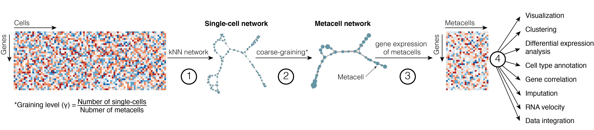

[](https://github.com/GfellerLab/SuperCell/actions)
[1E](https://doi.org/10.1186/s12859-022-04861-1)
[](./LICENSE)

# Coarse-graining of large single-cell RNA-seq data into metacells

SuperCell is an R package for coarse-graining large single-cell RNA-seq
data into metacells and performing downstream analysis at the metacell
level.

The exponential scaling of scRNA-seq data represents an important hurdle
for downstream analyses. One of the solutions to facilitate the analysis
of large-scale and noisy scRNA-seq data is to merge transcriptionally
highly similar cells into *metacells*. This concept was first introduced
by [*Baran et al., 2019*](https://doi.org/10.1186/s13059-019-1812-2)
(MetaCell) and by [*Iacono et al.,
2018*](https://doi:10.1101/gr.230771.117) (bigSCale). More recent
methods to build *metacells* have been described in [*Ben-Kiki et
al. 2022*](https://doi.org/10.1186/s13059-022-02667-1) (MetaCell2),
[*Bilous et al., 2022*](https://doi.org/10.1186/s12859-022-04861-1)
(SuperCell) and [*Persad et al.,
2022*](https://doi.org/10.1038/s41587-023-01716-9) (SEACells). Despite
some differences in the implementation, all the methods are
network-based and can be summarized as follows:

**1.** A single-cell network is computed based on cell-to-cell
similarity (in transcriptomic space)

**2.** Highly similar cells are identified as those forming dense
regions in the single-cell network and merged together into metacells
(coarse-graining)

**3.** Transcriptomic information within each metacell is combined
(average or sum).

**4.** Metacell data are used for the downstream analyses instead of
large-scale single-cell data



Unlike clustering, the aim of metacells is not to identify large groups
of cells that comprehensively capture biological concepts, like cell
types, but to merge cells that share highly similar profiles, and may
carry repetitive information. **Therefore metacells represent a
compromise structure that optimally remove redundant information in
scRNA-seq data while preserving the biologically relevant
heterogeneity.**

An important concept when building metacells is the **graining level**
(*γ*), which we define as the ratio between the number of single cells
in the initial data and the number of metacells. We suggest applying *γ*
between 10 and 50, which significantly reduces the computational
resources needed to perform the downstream analyses while preserving
most of the result of the initial (i.e., single-cell) analyses.

## Installation

SuperCell requires
[igraph](https://cran.r-project.org/web/packages/igraph/index.html),
[RANN](https://cran.r-project.org/web/packages/RANN/index.html),
[WeightedCluster](https://cran.r-project.org/web/packages/WeightedCluster/index.html),
[corpcor](https://cran.r-project.org/web/packages/corpcor/index.html),
[weights](https://cran.r-project.org/web/packages/weights/index.html),
[Hmisc](https://cran.r-project.org/web/packages/Hmisc/index.html),
[Matrix](https://cran.r-project.org/web/packages/Matrix/index.html),
[matrixStats](https://cran.rstudio.com/web/packages/matrixStats/index.html),
[plyr](https://cran.r-project.org/web/packages/plyr/index.html),
[irlba](https://cran.r-project.org/web/packages/irlba/index.html),
[grDevices](https://stat.ethz.ch/R-manual/R-devel/library/grDevices/html/00Index.html),
[patchwork](https://cran.r-project.org/web/packages/patchwork/index.html),
[ggplot2](https://cloud.r-project.org/web/packages/ggplot2/index.html).
SuperCell uses [velocyto.R](https://github.com/velocyto-team/velocyto.R)
for RNA velocity.

``` r
install.packages("igraph")
install.packages("RANN")
install.packages("WeightedCluster")
install.packages("corpcor")
install.packages("weights")
install.packages("Hmisc")
install.packages("Matrix")
install.packages("patchwork")
install.packages("plyr")
install.packages("irlba")
```

Installing SuperCell package from gitHub

``` r
if (!requireNamespace("remotes")) install.packages("remotes")
remotes::install_github("GfellerLab/SuperCell")

library(SuperCell)
```

## Examples

1.  [Building and analyzing metacells with
    SuperCell](./vignettes/a_SuperCell.Rmd)
2.  [RNA velocity applied to SuperCell
    object](./vignettes/c_RNAvelocity_for_SuperCell.Rmd)
3.  [Building metacells with SuperCell and alayzing them with a standard
    Seurat
    pipeline](https://github.com/GfellerLab/SIB_workshop/blob/main/workbooks/Workbook_1__cancer_cell_lines.md)
4.  [Data integration of metacells built with
    SuperCell](https://github.com/GfellerLab/SIB_workshop/blob/main/workbooks/Workbook_2__COVID19_integration.md)

## How to cite

If you use SuperCell in a publication, please cite: [Bilous et
al. Metacells untangle large and complex single-cell transcriptome
networks, BMC Bioinformatics
(2022).](https://doi.org/10.1186/s12859-022-04861-1)
