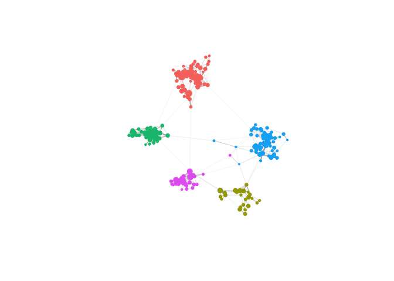
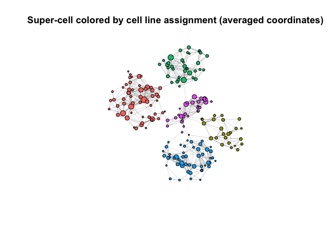
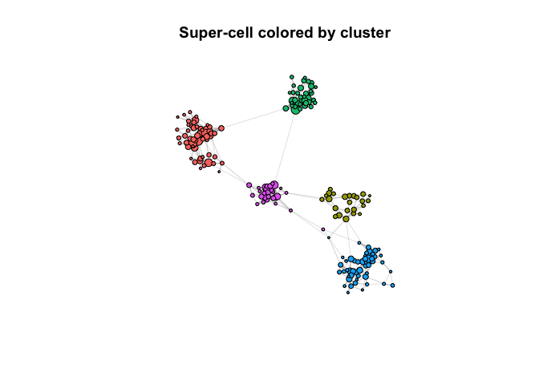
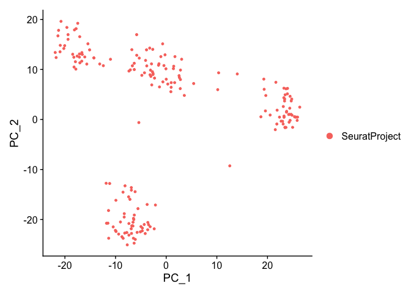

# Installation

SuperCell requires
[igraph](https://cran.r-project.org/web/packages/igraph/index.html),
[RANN](https://cran.r-project.org/web/packages/RANN/index.html),
[WeightedCluster](https://cran.r-project.org/web/packages/WeightedCluster/index.html),
[corpcor](https://cran.r-project.org/web/packages/corpcor/index.html),
[weights](https://cran.r-project.org/web/packages/weights/index.html),
[Hmisc](https://cran.r-project.org/web/packages/Hmisc/index.html),
[Matrix](https://cran.r-project.org/web/packages/Matrix/index.html),
[matrixStats](https://cran.rstudio.com/web/packages/matrixStats/index.html),
[plyr](https://cran.r-project.org/web/packages/plyr/index.html),
[irlba](https://cran.r-project.org/web/packages/irlba/index.html)

``` r
# install.packages("igraph")
# install.packages("RANN")
# install.packages("WeightedCluster")
# install.packages("corpcor")
# install.packages("weights")
# install.packages("Hmisc")
# install.packages("Matrix")
# install.packages("matrixStats")
# install.packages("plyr")
# install.packages("irlba")
```

Installing SuperCell package from gitHub

``` r
# if (!requireNamespace("remotes")) install.packages("remotes")
# remotes::install_github("GfellerLab/SuperCell")

library(SuperCell)
```

# Analysis

## Load scRNA-seq data of 5 cancer cell lines from [Tian et al., 2019](https://doi.org/10.1038/s41592-019-0425-8).

Data available at authors’
[GitHub](https://github.com/LuyiTian/sc_mixology/blob/master/data/)
under file name *sincell_with_class_5cl.Rdata*.

``` r
data(cell_lines) # list with GE - gene expression matrix (logcounts), meta - cell meta data
GE <- cell_lines$GE
dim(GE) # genes as rows and cells as columns
## [1] 11786  3918
cell.meta <- cell_lines$meta
```

## Simplify single-cell data at the graining level *g**a**m**m**a* = 20

(i.e., `20` times less super-cells than single cells) by first building
a kNN (*k* = 5) network using top *n*.*v**a**r*.*g**e**n**e**s* = 1000
most variable genes for dimentionality reduction.

``` r
gamma <- 20 # graining level

SC <- SCimplify(GE,  # gene expression matrix 
                k.knn = 5, # number of nearest neighbors to build kNN network
                gamma = gamma, # graining level
                n.var.genes = 1000) # number of the top variable genes to use for dimentionality reduction 

# plot super-cell network
supercell_plot(SC$graph.supercells, # network
               color.use = "gray", # color of the nodes
               main = paste("Super-cell network, gamma =", gamma), 
               seed = 1) 
```


``` r
# plot single-cell network
supercell_plot(SC$graph.singlecell, # network
               group = cell.meta, # colored by cell line assignment
               do.frames = F, # not drawing frames around each node 
               main = paste("Single-cell network, N =", dim(GE)[2]), 
               lay.method = "components") # method to compute the network 2D embedding 
```


## Compute gene expression for simplified data

Function `SCimplify` computes the partition into super-cells, this
information is available with the field `membership`. To get a gene
expression of super-cells, we need to average gene expressions within
each super-cell with function `supercell_GE`

``` r
SC.GE <- supercell_GE(GE, SC$membership)
dim(SC.GE) 
## [1] 11786   196
```

\#Map each super-cell to a particular cell line We now assing super-cell
to a particular cell line based on the assignment of single cells it
contains, for this, we use function `supercell_assign`. By default, this
function assign each super-cell to a cluster with the largest Jaccard
coefficient to avoid biases towards very rare or very abundant clusters.
Alternatively, assigmnent can be performed using relative or absolute
abundance with `method = "relative"` or `method = "absolute"`,
respectively.

``` r
SC2cellline  <- supercell_assign(clusters = cell.meta, # single-cell assigment to clusters
                                 supercell_membership = SC$membership, # single-cell assignment to super-cells
                                 method = "jaccard")
SC$cell_line <- SC2cellline


seed <- 1 # seed for super-cell network plotting 

# plot super-cell network colored by cell line assignment 
supercell_plot(SC$graph.supercells, 
               group = SC$cell_line, 
               seed = seed, 
               main = "Super-cell colored by cell line assignment")
```


Some options to plot super-cell networks

``` r
## rotate network to be more consistent with the single-cell one
supercell_plot(SC$graph.supercells, 
               group = SC$cell_line, 
               seed = seed, 
               alpha = -pi/2,
               main  = "Super-cell colored by cell line assignment (rotated)")
```



``` r
## alternatively, any layout can be provided as 2xN numerical matrix, where N is number of nodes (cells)

## Let's plot super-cell network using the layout of the single-cell network:
## 1) get single-cell network layout 
my.lay.sc <- igraph::layout_components(SC$graph.singlecell) 

## 2) compute super-cell network layout averaging coordinates withing super-cells
my.lay.SC <- t(supercell_GE(ge = t(my.lay.sc), groups = SC$membership))

## 3) provide layout with the parameter $lay$
supercell_plot(SC$graph.supercells, 
               group = SC$cell_line, 
               lay = my.lay.SC,
               main  = "Super-cell colored by cell line assignment (averaged coordinates)")
```



## Cluster super-cell data

``` r
#dimensionality reduction 
SC.PCA         <- supercell_prcomp(t(SC.GE), # super-cell gene exptression matrix
                                   genes.use = SC$genes.use, # genes used for the coarse-graining, but any set can be provided
                                   supercell_size = SC$supercell_size, # sample-weighted pca
                                   k = 20) 
## compute distance
D              <- dist(SC.PCA$x)

## cluster super-cells
SC.clusters    <- supercell_cluster(D = D, k = 5, supercell_size = SC$supercell_size) 
SC$clustering  <- SC.clusters$clustering
```

## Map clusters of super-cells to cell lines

``` r
## mapping super-cell cluster to cell line 
map.cluster.to.cell.line    <- supercell_assign(supercell_membership = SC$clustering, clusters  = SC$cell_line)
## clustering as cell line
SC$clustering_reordered     <- map.cluster.to.cell.line[SC$clustering]

supercell_plot(SC$graph.supercells, 
               group = SC$clustering_reordered, 
               seed = seed,
               alpha = -pi/2,
               main = "Super-cell colored by cluster")
```



## Differential expression analysis of clustered super-cell data

``` r
markers.all.positive <- supercell_FindAllMarkers(ge = SC.GE, # super-cell gene expression matrix
                                                 supercell_size = SC$supercell_size, # size of super-cell for sample-weighted method
                                                 clusters = SC$clustering_reordered, # clustering
                                                 logfc.threshold = 1, # mininum log fold-change
                                                 only.pos = T) # keep only upregulated genes
markers.all.positive$H1975[1:20,]
##         p.value adj.p.value     pct.1     pct.2    logFC  w.mean.1   w.mean.2
## DHRS2         0           0 1.0000000 0.8279230 4.091797 3.6237875 0.10054192
## MT1E          0           0 1.0000000 0.9413962 3.686582 4.6560576 0.69254917
## PEG10         0           0 1.0000000 0.9652399 2.564663 3.2359195 0.89548751
## LGALS1        0           0 1.0000000 1.0000000 2.394249 6.5798440 4.00039835
## S100A2        0           0 1.0000000 0.9942545 2.338876 3.1041134 1.24595811
## ZNF880        0           0 1.0000000 0.5955185 1.821237 1.6675772 0.08666412
## MT2A          0           0 1.0000000 1.0000000 1.724771 6.3843539 4.12274024
## CT45A2        0           0 1.0000000 0.6153404 1.684419 1.7640705 0.27318252
## XAGE1B        0           0 1.0000000 1.0000000 1.669853 6.5436587 3.66859782
## HSPB1         0           0 1.0000000 1.0000000 1.645122 5.5983707 3.87890578
## PRDX2         0           0 1.0000000 0.9494398 1.638760 3.4980150 1.33455473
## IFI27         0           0 1.0000000 0.9462798 1.636429 3.5275622 1.32877161
## MT1P1         0           0 1.0000000 0.9988509 1.550382 3.2663495 1.50666087
## TMEM134       0           0 1.0000000 0.9988509 1.508863 2.4398008 1.01156248
## TNNT1         0           0 1.0000000 0.9844872 1.482153 3.2983849 1.63217280
## XAGE1A        0           0 1.0000000 0.9750072 1.458697 2.8883699 1.06459003
## MT2P1         0           0 1.0000000 0.9925309 1.457833 2.7769310 1.18613463
## DMKN          0           0 1.0000000 0.9821890 1.455548 2.6011521 0.83344367
## CAV1          0           0 1.0000000 1.0000000 1.388689 4.1486580 2.37528254
## MGP           0           0 0.9427918 0.2071244 1.365311 0.6735631 0.01058892
```

### P.S.: Super-cell to [Seurat](https://cran.r-project.org/web/packages/Seurat/index.html) object

In case you want to perform other analyses available with Seurat
package, we can coerce super-cells to Seurat object with function
`supercell_2_Seurat`

``` r
#install.packages("Seurat")
library(Seurat)
## Warning: package 'Seurat' was built under R version 3.6.2

m.seurat <- supercell_2_Seurat(SC.GE = SC.GE, SC = SC, fields = c("cell_line", "clustering", "clustering_reordered"))
## PC_ 1 
## Positive:  VMP1, KRCC1, CTSD, RNF145, SSR4, SLC25A6, XAGE1B, ABCC3, GOLM1, NPDC1 
##     MT-TW, SVIP, EPS8, IER3, ASPH, ITGA3, OCIAD2, CYB5A, NAMPTP1, SPINT2 
##     SMIM14, NDUFAF2, NAMPT, P4HB, DCBLD2, NDUFS4, PYCARD, IGFBP3, UGDH, PDIA4 
## Negative:  GAGE12H, GAGE12D, GAGE12C, GAGE12E, GAGE1, GAGE12J, GAGE12G, GAGE13, GAGE2E, GAGE2A 
##     CTAG2, TIMM8B, AC244153.1, GAGE10, MAGEA4, CPA4, MAGEA6, DNM1L, CT45A3, GSTM3 
##     KRT17, LAPTM4B, CT45A7, MYL9, ATP5F1EP2, CASC15, LAMTOR5, MRPL42, MED21, SSH2 
## PC_ 2 
## Positive:  TM4SF1, TFPI2, PON2, ALDH1A1, UQCRFS1, B4GALT4, KRT81, TESC, INSL4, RPS4Y1 
##     TM4SF20, PSMD8, AKR1B10, CYP24A1, TMED3, PCBD1, TM4SF4, S100A4, CCND3, PDLIM5 
##     CPLX2, RAB10, CYSTM1, NT5C, ETFB, CLU, TKT, GPX2, BAX, CFD 
## Negative:  RAMP1, MT2A, RHOBTB3, AL669983.1, TSTD1, RPL12P6, SUMO3, KDELR2, HDGF, AC018738.1 
##     MT1P1, MAP3K13, MT2P1, B2M, CASP4, PRDX2, IFI27, C6orf48, MDK, AL122020.1 
##     GUK1, ISG15, CTHRC1, RNASEH2C, TBL1XR1, ERO1A, RPS10, IFI16, APLP2, C15orf48 
## PC_ 3 
## Positive:  DKC1, CCT6A, PGK1, RBM8B, ANXA3, EIF3D, RBM8A, HNRNPM, TUBB4B, HSP90AA2P 
##     EIF2S1, XRCC6, CCT5, PPA1, LDHA, MAGOH, ENO1, COPS5, HSP90AA1, POLR2G 
##     PSMC2, CCT8, PSME2P2, PSMB3, ATP5F1B, SRI, ILF2, PSME2, AIMP1, GLRX3 
## Negative:  PTP4A2, AES, FTL, B4GALT1, MALAT1, ZNF428, NEAT1, LITAF, ERLEC1, SAT1 
##     PFN2, FTH1P10, NMB, BID, FTLP3, FTH1P8, HP1BP3, IFITM2, TOR1AIP2, CTTN 
##     FTH1P7, MAP1B, KRT10, IGFBP4, FTH1P5, FTH1P11, AC092069.1, MORF4L1P1, RPS27L, DUSP23 
## PC_ 4 
## Positive:  ANXA5, PSMB1, UBXN4, PSMA1, PSMD14, TUBB, CALU, NUDT5, SERPINE2, AP2M1 
##     EIF4A2, TRAPPC4, UQCRC2, TUBA4A, HLA-A, PSMD2, TMED10, NUCB2, HSPA8, EMP2 
##     TMEM59, NNMT, HSPA9, TALDO1, EIF3CL, PLAUR, CUTA, LMAN1, PDIA3, CD59 
## Negative:  EIF5A, SCD, CAV2, PPP1CB, H2AFJ, TMEM256, TJP1, BRI3, MRPL33, EMC6 
##     ITGAE, NAA38, PEG10, SUMF2, IAH1, SNHG8, CTDNEP1, FIS1, CYTOR, ACP1 
##     LAMTOR4, TNNT1, TMEM134, HSPB1, PHKG1, ARHGAP29, AHNAK, C20orf27, ISOC2, C12orf75 
## PC_ 5 
## Positive:  AC107075.1, PNRC1, HIST2H2AA3, EIF3E, TUBA1A, AKAP9, PPIB, PGLS, HERPUD1, LAPTM4A 
##     ZNHIT1, TMEM59, NEAT1, ITM2B, GRN, ATP5F1A, CST3, REEP5, ARF4, GOLGB1 
##     PDIA3, AC044787.1, ACADVL, CHMP2A, RPS4XP11, EIF3M, HSPA5, RPL5P34, TMEM205, SERPINB1 
## Negative:  PCLAF, HNRNPAB, CKS1B, TMPO, MKI67, H2AFZ, ZWINT, CENPK, DTYMK, DEK 
##     TOP2A, HIST1H4C, TK1, BIRC5, ATAD2, CENPF, NUSAP1, CENPW, RPL39L, HELLS 
##     UBE2T, TPX2, H2AFX, CLSPN, HMGB2, MYBL2, PHF19, CENPN, ASPM, SMC4
## Computing nearest neighbor graph
```

Note: since super-cells have different size (consist of different number
of cells), we apply sample-weighted algorithms at most af the steps of
the downstream analyses. Thus, when coercing super-cell to Seurat, we
replaced PCA, saling and kNN graph of Seurat object with those obtained
applying sample-weighted version of PCA, scaling or super-cell graph,
respectively. If you then again apply *R**u**n**P**C**A*,
*S**c**a**l**e**D**a**t**a*, or *F**i**n**d**N**e**i**g**h**b**o**r**s*,
the result will be rewritten, but you will be able to access them with
$Embeddings(m.seurat, reduction = "pca_weigted")$,
*m*.*s**e**u**r**a**t*@*a**s**s**a**y**s*<RNA@misc>\[\[“scale.data.weighted”\]\]$,
or *m*.*s**e**u**r**a**t*@*g**r**a**p**h**s*RNA_super_cells$,
respectively.

``` r
PCAPlot(m.seurat)
```



``` r
### cluster super-cell network (unweighted clustering)
m.seurat <- FindClusters(m.seurat, graph.name = "RNA_super_cells")
## Modularity Optimizer version 1.3.0 by Ludo Waltman and Nees Jan van Eck
## 
## Number of nodes: 196
## Number of edges: 703
## 
## Running Louvain algorithm...
## Maximum modularity in 10 random starts: 0.8322
## Number of communities: 7
## Elapsed time: 0 seconds

m.seurat <- FindClusters(m.seurat, graph.name = "RNA_nn") # now RNA_nn is super-cell network
## Modularity Optimizer version 1.3.0 by Ludo Waltman and Nees Jan van Eck
## 
## Number of nodes: 196
## Number of edges: 703
## 
## Running Louvain algorithm...
## Maximum modularity in 10 random starts: 0.8322
## Number of communities: 7
## Elapsed time: 0 seconds

m.seurat <- FindNeighbors(m.seurat)  # RNA_nn has been replaced with kNN graph of super-cell (unweigted)
## Computing nearest neighbor graph
## Computing SNN
m.seurat <- FindClusters(m.seurat, graph.name = "RNA_nn") 
## Modularity Optimizer version 1.3.0 by Ludo Waltman and Nees Jan van Eck
## 
## Number of nodes: 196
## Number of edges: 2013
## 
## Running Louvain algorithm...
## Maximum modularity in 10 random starts: 0.7904
## Number of communities: 5
## Elapsed time: 0 seconds
```
