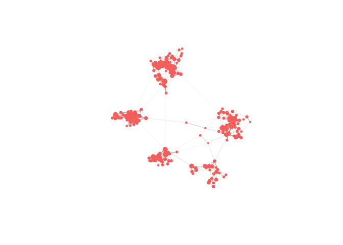
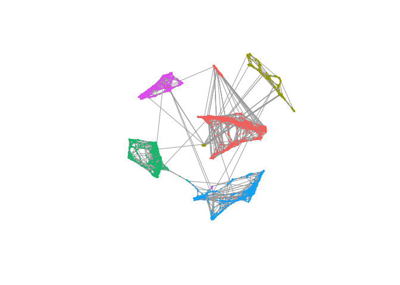

Example of Supercell pipeline
================

# Installation

``` r
#devtools::install_github("mariiabilous/SCimple")
library(SCimple)
#library(igraph)
```

# Load data of 5 cancer cell lines sequenced with 10x from [Tian et al., 2019](https://doi.org/10.1038/s41592-019-0425-8)

``` r
GE <- readRDS("./data/5cancer_cell_lines_10x_GE.Rds") # load gene expression matrix
dim(GE) # genes as rows and cells as columns
## [1] 11786  3918
cell.meta <- readRDS("./data/5cancer_cell_lines_10x_cell_line_assignment.Rds") # load cell assignment to a cancer cell line
```

# Simplify single-cell data reducing numer of super-cell \(gamma = 20\) times comparing to the number of single cells

``` r
SC <- SCimplify(GE, k.knn = 5, gamma = 20, n.var.genes = 2000, use.nn2 = FALSE)
## [1] "Start knn_graph_from_dist"
set.seed(12345)
supercell_plot(SC$graph.supercells)
```

<!-- -->

``` r
supercell_plot(SC$graph.singlecell, group = cell.meta, do.frames = T)
```

<!-- -->

\#Compute gene expression for simplified data

``` r
SC.GE <- supercell_GE(GE, SC$membership)
dim(SC.GE)
## [1] 11786   196
```

\#Map each super-cell to a particular cell line

``` r
SC2cellline  <- supercell_assign(cell.meta, SC$membership)
SC$cell_line <- SC2cellline

supercell_plot(SC$graph.supercells, group = SC$cell_line)
```

<!-- -->

Cluster super-cell
data

``` r
SC.PCA     <- supercell_prcomp(t(SC.GE), genes.use = SC$genes.use, supercell_size = SC$supercell_size, k = 20)
dim(SC.PCA$x)
## [1] 196  20
D          <- dist(SC.PCA$x)

SC.cluster <- supercell_cluster(D = D, k = 5, supercell_size = SC$supercell_size)
SC$clustering <- SC.cluster$clustering
```

Differential expression analysis of clustered super-cell
data

``` r
markers.all <- supercell_FindAllMarkers(SC.GE, SC$supercell_size, SC$clustering, logfc.threshold = 1)
sum(markers.all[[1]]$adj.p.value < 0.05)
## [1] 353
```
