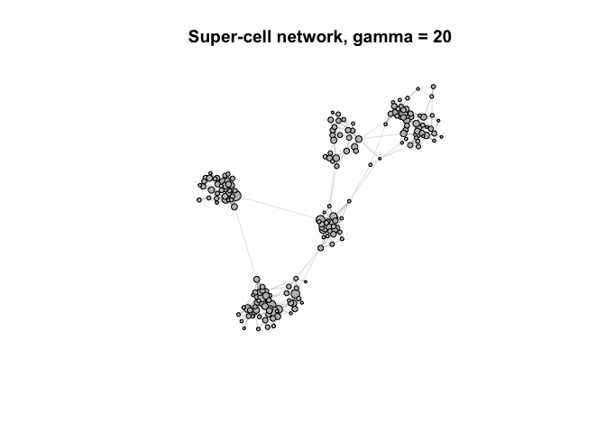
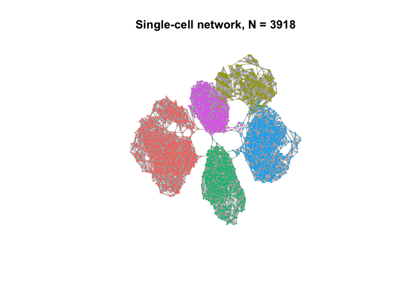
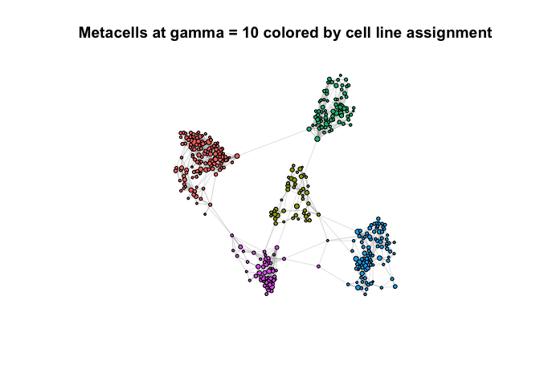
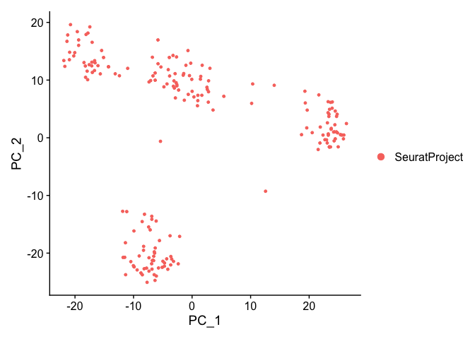

Installation
============

SuperCell requires
[igraph](https://cran.r-project.org/web/packages/igraph/index.html),
[RANN](https://cran.r-project.org/web/packages/RANN/index.html),
[WeightedCluster](https://cran.r-project.org/web/packages/WeightedCluster/index.html),
[corpcor](https://cran.r-project.org/web/packages/corpcor/index.html),
[weights](https://cran.r-project.org/web/packages/weights/index.html),
[Hmisc](https://cran.r-project.org/web/packages/Hmisc/index.html),
[Matrix](https://cran.r-project.org/web/packages/Matrix/index.html),
[matrixStats](https://cran.rstudio.com/web/packages/matrixStats/index.html),
[plyr](https://cran.r-project.org/web/packages/plyr/index.html),
[irlba](https://cran.r-project.org/web/packages/irlba/index.html),
[grDevices](https://stat.ethz.ch/R-manual/R-devel/library/grDevices/html/00Index.html),
[patchwork](https://cran.r-project.org/web/packages/patchwork/index.html),
[ggplot2](https://cloud.r-project.org/web/packages/ggplot2/index.html).
SuperCell uses [velocyto.R](https://github.com/velocyto-team/velocyto.R)
for RNA velocity.

``` r
# install.packages("igraph")
# install.packages("RANN")
# install.packages("WeightedCluster")
# install.packages("corpcor")
# install.packages("weights")
# install.packages("Hmisc")
# install.packages("Matrix")
# install.packages("patchwork")
# install.packages("plyr")
# install.packages("irlba")
```

Installing SuperCell package from gitHub

``` r
#if (!requireNamespace("remotes")) install.packages("remotes")
#remotes::install_github("GfellerLab/SuperCell")

library(SuperCell)
```

Analysis
========

Load scRNA-seq data of 5 cancer cell lines from [Tian et al., 2019](https://doi.org/10.1038/s41592-019-0425-8).
---------------------------------------------------------------------------------------------------------------

Data available at authors’
[GitHub](https://github.com/LuyiTian/sc_mixology/blob/master/data/)
under file name *sincell\_with\_class\_5cl.Rdata*.

``` r
data(cell_lines) # list with GE - gene expression matrix (logcounts), meta - cell meta data
GE <- cell_lines$GE
dim(GE) # genes as rows and cells as columns
## [1] 11786  3918
cell.meta <- cell_lines$meta
```

Simplify single-cell data at the graining level *g**a**m**m**a* = 20
--------------------------------------------------------------------

(i.e., `20` times less metacells (called ‘supercells’ in the package
functions) than single cells) by first building a kNN (*k* = 5) network
using top *n*.*v**a**r*.*g**e**n**e**s* = 1000 most variable genes for
dimentionality reduction. Function `SCimplify()` computes the partition
into metacells, this information is available with the field
`membership`.

``` r
gamma <- 20 # graining level
k.knn <- 5

SC <- SCimplify(GE,  # gene expression matrix 
                k.knn = k.knn, # number of nearest neighbors to build kNN network
                gamma = gamma, # graining level
                n.var.genes = 1000 # number of the top variable genes to use for dimentionality reduction 
)


# plot network of metacells

supercell_plot(SC$graph.supercells, # network
               color.use = "gray", # color of the nodes
               main = paste("Metacell network, gamma =", gamma), 
               seed = 1) 
```



``` r

# plot single-cell network
supercell_plot(SC$graph.singlecell, # network
               group = cell.meta, # colored by cell line assignment
               do.frames = F, # not drawing frames around each node 
               main = paste("Single-cell network, N =", dim(GE)[2]), 
               lay.method = "components") # method to compute the network 2D embedding 
```



Compute gene expression for simplified data
-------------------------------------------

To get a gene expression of metaccells, we need to average gene
expressions within each metacell with function `supercell_GE()`

``` r
SC.GE <- supercell_GE(GE, SC$membership)
dim(SC.GE) 
## [1] 11786   196
```

Map each metacell to a particular cell line
-------------------------------------------

We now assign each metcell to a particular cell line based on the cell
line data, for this, we use function `supercell_assign()`. By default,
this function assign each metacell to a cluster with the largest Jaccard
coefficient to avoid biases towards very rare or very abundant clusters.
Alternatively, assigmnent can be performed using relative (may cause
biase towards very small populations) or absolute (may cause biase
towards large populations) abundance with `method = "relative"` or
`method = "absolute"`, respectively.

``` r
SC$cell_line <- supercell_assign(clusters = cell.meta, # single-cell assigment to cell lines (clusters)
                                 supercell_membership = SC$membership, # single-cell assignment to metacells
                                 method = "jaccard")


seed <- 1 # seed for network plotting 

# plot network of metacells colored by cell line assignment 
supercell_plot(SC$graph.supercells, 
               group = SC$cell_line, 
               seed = seed, 
               main = "Metacells colored by cell line assignment")
```


The quality of assigment can be evaluated with metacell purity (function
`supercell_purity()`) that returns the proportion of the most abundant
cell type (in this case, cell line) in each metacell.

``` r
# compute purity of metacells in terms of cell line composition
purity <- supercell_purity(clusters = cell.meta, 
                           supercell_membership = SC$membership, method = 'entropy')
hist(purity, main = "Purity of metacells \nin terms of cell line composition")
```


Some options to plot networks of metacells

``` r
## rotate network to be more consistent with the single-cell one
supercell_plot(SC$graph.supercells, 
               group = SC$cell_line, 
               seed = seed, 
               alpha = -pi/2,
               main  = "Metacells colored by cell line assignment (rotated)")
```


``` r

## alternatively, any layout can be provided as 2xN numerical matrix, where N is number of nodes (cells)

## Let's plot metacell network using the layout of the single-cell network:
## 1) get single-cell network layout 
my.lay.sc <- igraph::layout_components(SC$graph.singlecell) 

## 2) compute metacell network layout averaging coordinates withing metacells
my.lay.SC <- Matrix::t(supercell_GE(ge = t(my.lay.sc), groups = SC$membership))

## 3) provide layout with the parameter $lay$
supercell_plot(SC$graph.supercells, 
               group = SC$cell_line, 
               lay = my.lay.SC,
               main  = "Metacells colored by cell line assignment (averaged coordinates)")
```


Cluster metacell data
---------------------

``` r
#dimensionality reduction 
SC.PCA         <- supercell_prcomp(Matrix::t(SC.GE), # metacell gene exptression matrix
                                   genes.use = SC$genes.use, # genes used for the coarse-graining, but any set can be provided
                                   supercell_size = SC$supercell_size, # sample-weighted pca
                                   k = 20) 
## compute distance
D              <- dist(SC.PCA$x)

## cluster metacells
SC.clusters    <- supercell_cluster(D = D, k = 5, supercell_size = SC$supercell_size) 
SC$clustering  <- SC.clusters$clustering
```

Map clusters of metacells to cell lines
---------------------------------------

``` r
## mapping metacell cluster to cell line 
map.cluster.to.cell.line    <- supercell_assign(supercell_membership = SC$clustering, clusters  = SC$cell_line)
## clustering as cell line
SC$clustering_reordered     <- map.cluster.to.cell.line[SC$clustering]

supercell_plot(SC$graph.supercells, 
               group = SC$clustering_reordered, 
               seed = seed,
               alpha = -pi/2,
               main = "Metacells colored by cluster")
```


Differential expression analysis of clustered metacell data
-----------------------------------------------------------

``` r
markers.all.positive <- supercell_FindAllMarkers(ge = SC.GE, # metacell gene expression matrix
                                                 supercell_size = SC$supercell_size, # size of metacell for sample-weighted method
                                                 clusters = SC$clustering_reordered, # clustering
                                                 logfc.threshold = 1, # mininum log fold-change
                                                 only.pos = T) # keep only upregulated genes
markers.all.positive$H1975[1:20,]
##         p.value adj.p.value     pct.1     pct.2    logFC  w.mean.1   w.mean.2
## DHRS2         0           0 1.0000000 0.8279230 4.091797 3.6237875 0.10054192
## MT1E          0           0 1.0000000 0.9413962 3.686582 4.6560576 0.69254917
## PEG10         0           0 1.0000000 0.9652399 2.564663 3.2359195 0.89548751
## LGALS1        0           0 1.0000000 1.0000000 2.394249 6.5798440 4.00039835
## S100A2        0           0 1.0000000 0.9942545 2.338876 3.1041134 1.24595811
## ZNF880        0           0 1.0000000 0.5955185 1.821237 1.6675772 0.08666412
## MT2A          0           0 1.0000000 1.0000000 1.724771 6.3843539 4.12274024
## CT45A2        0           0 1.0000000 0.6153404 1.684419 1.7640705 0.27318252
## XAGE1B        0           0 1.0000000 1.0000000 1.669853 6.5436587 3.66859782
## HSPB1         0           0 1.0000000 1.0000000 1.645122 5.5983707 3.87890578
## PRDX2         0           0 1.0000000 0.9494398 1.638760 3.4980150 1.33455473
## IFI27         0           0 1.0000000 0.9462798 1.636429 3.5275622 1.32877161
## MT1P1         0           0 1.0000000 0.9988509 1.550382 3.2663495 1.50666087
## TMEM134       0           0 1.0000000 0.9988509 1.508863 2.4398008 1.01156248
## TNNT1         0           0 1.0000000 0.9844872 1.482153 3.2983849 1.63217280
## XAGE1A        0           0 1.0000000 0.9750072 1.458697 2.8883699 1.06459003
## MT2P1         0           0 1.0000000 0.9925309 1.457833 2.7769310 1.18613463
## DMKN          0           0 1.0000000 0.9821890 1.455548 2.6011521 0.83344367
## CAV1          0           0 1.0000000 1.0000000 1.388689 4.1486580 2.37528254
## MGP           0           0 0.9427918 0.2071244 1.365311 0.6735631 0.01058892
```

Some additional plotting options
--------------------------------

``` r
genes.to.plot <- c("DHRS2", "MT1P1", "TFF1", "G6PD", "CCL2", "C1S")

supercell_VlnPlot(ge = SC.GE, 
                  supercell_size = SC$supercell_size, 
                  clusters = SC$clustering_reordered,
                  features = genes.to.plot,
                  idents = c("H1975", "H2228", "A549"), 
                  ncol = 3)
```


``` r

supercell_GeneGenePlot(ge = SC.GE, 
                       gene_x = genes.to.plot[1:3],
                       gene_y = genes.to.plot[4:6],
                       supercell_size = SC$supercell_size, 
                       clusters = SC$clustering_reordered,)
## $p
```


    ## 
    ## $w.cor
    ## $w.cor$TFF1_C1S
    ## [1] -0.2127742
    ## 
    ## $w.cor$DHRS2_G6PD
    ## [1] -0.2069167
    ## 
    ## $w.cor$MT1P1_CCL2
    ## [1] 0.1232393
    ## 
    ## 
    ## $w.pval
    ## $w.pval$TFF1_C1S
    ## [1] 2.392685e-41
    ## 
    ## $w.pval$DHRS2_G6PD
    ## [1] 3.781028e-39
    ## 
    ## $w.pval$MT1P1_CCL2
    ## [1] 9.856287e-15

### SuperCell graining level can be quickly chaged with `supercell_rescale()` function

``` r
SC10 <- supercell_rescale(SC, gamma = 10)

SC10$cell_line <- supercell_assign(clusters = cell.meta, # single-cell assigment to cell lines (clusters)
                                 supercell_membership = SC10$membership, # single-cell assignment to metacells
                                 method = "jaccard")

supercell_plot(SC10$graph.supercells, 
               group = SC10$cell_line, 
               seed = 1,
               main  = "Metacells at gamma = 10 colored by cell line assignment")
```



``` r

### don't forget to recompute metacell gene expression matrix for a new grainig level with 
# GE10 <- supercell_GE(GE, SC10$membership)
### if you are going to perform downstream analyses at the new graining level
```

### P.S.: SuperCell to [Seurat](https://cran.r-project.org/web/packages/Seurat/index.html) object

In case you want to perform other analyses available with Seurat
package, we can convert SuperCell to
[Seurat](https://cran.r-project.org/web/packages/Seurat/index.html)
object with function `supercell_2_Seurat()` or to
[SingleCellExperiment](https://bioconductor.org/packages/release/bioc/html/SingleCellExperiment.html)
object with function ‘supercell\_2\_sce()’. Let consider a Seurat
example.

``` r
#install.packages("Seurat")
library(Seurat)
## Attaching SeuratObject

m.seurat <- supercell_2_Seurat(SC.GE = SC.GE, SC = SC, fields = c("cell_line", "clustering", "clustering_reordered"))
## [1] "Done: NormalizeData"
## [1] "Doing: data to normalized data"
## [1] "Doing: weighted scaling"
## [1] "Done: weighted scaling"
```

Note: since metacells have different size (consist of different number
of cells), we apply sample-weighted algorithms at most af the steps of
the downstream analyses. Thus, when coercing SuperCell to Seurat, we
replaced PCA, saling and kNN graph of Seurat object with those obtained
applying sample-weighted version of PCA, scaling or SuperCell graph
(i.e., metacell network), respectively. If you then again apply
`RunPCA`, `ScaleData`, or `FindNeighbors`, the result will be rewritten,
but you will be able to access them with
`Embeddings(m.seurat, reduction = "pca_weigted")`,
`m.seurat@assays$RNA@misc[["scale.data.weighted"]]`, or
`m.seurat@graphs$RNA_super_cells`, respectively.

``` r
PCAPlot(m.seurat)
```



``` r

### cluster SuperCell network (unweighted clustering)
m.seurat <- FindClusters(m.seurat, graph.name = "RNA_nn") # now RNA_nn is metacell network
## Modularity Optimizer version 1.3.0 by Ludo Waltman and Nees Jan van Eck
## 
## Number of nodes: 196
## Number of edges: 703
## 
## Running Louvain algorithm...
## Maximum modularity in 10 random starts: 0.8322
## Number of communities: 7
## Elapsed time: 0 seconds

m.seurat <- FindNeighbors(m.seurat, verbose = FALSE)  # RNA_nn has been replaced with kNN graph of metacell (unweigted)
m.seurat <- FindClusters(m.seurat, graph.name = "RNA_nn") 
## Modularity Optimizer version 1.3.0 by Ludo Waltman and Nees Jan van Eck
## 
## Number of nodes: 196
## Number of edges: 2010
## 
## Running Louvain algorithm...
## Maximum modularity in 10 random starts: 0.7908
## Number of communities: 5
## Elapsed time: 0 seconds
```

[RNA velocity applied to SuperCell object](https://github.com/GfellerLab/SuperCell/blob/master/workbooks/RNAvelocity_for_SuperCells.md)
=======================================================================================================================================

[License](https://github.com/GfellerLab/SuperCell/blob/master/License.pdf)
==========================================================================

SuperCell is developed by the group of David Gfeller at University of
Lausanne.

SuperCell can be used freely by academic groups for non-commercial
purposes (see
[license](https://github.com/GfellerLab/SuperCell/blob/master/License.pdf)).
The product is provided free of charge, and, therefore, on an “as is”
basis, without warranty of any kind.

FOR-PROFIT USERS

If you plan to use SuperCell or any data provided with the script in any
for-profit application, you are required to obtain a separate license.
To do so, please contact <eauffarth@licr.org> at the Ludwig Institute
for Cancer Research Ltd.

If required, FOR-PROFIT USERS are also expected to have proper licenses
for the tools used in SuperCell, including the R packages igraph, RANN,
WeightedCluster, corpora, weights, Hmisc, Matrix, ply, irlba, grDevices,
patchwork, ggplot2 and velocyto.R

For scientific questions, please contact Mariia Bilous
(<mariia.bilous@unil.ch>) or David Gfeller (<David.Gfeller@unil.ch>).

How to cite
===========

If you use SuperCell in a publication, please cite: [Bilous et
al. Metacells untangle large and complex single-cell transcriptome
networks, BioRxiv
(2022).](https://www.biorxiv.org/content/10.1101/2021.06.07.447430v2)
