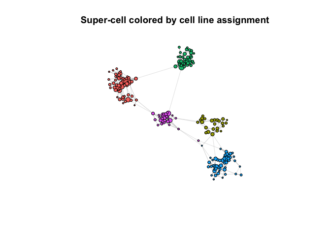
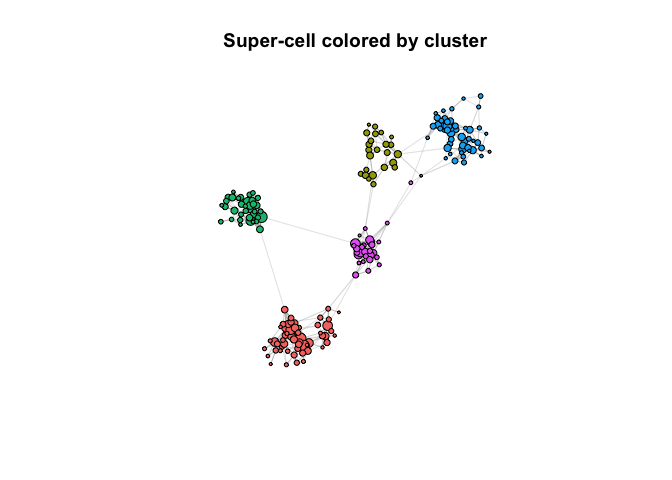

Installation
============

``` r
#devtools::install_github("GfellerLab/SuperCell")
library(SuperCell)
```

Analysis
========

Load scRNA-seq data of 5 cancer cell lines from [Tian et al., 2019](https://doi.org/10.1038/s41592-019-0425-8).
---------------------------------------------------------------------------------------------------------------

Data available at authors’
[GitHub](https://github.com/LuyiTian/sc_mixology/blob/master/data/)
under file name *sincell\_with\_class\_5cl.Rdata*

``` r
GE <- readRDS("./data/5cancer_cell_lines_10x_GE.Rds") # load gene expression matrix (logcounts)
dim(GE) # genes as rows and cells as columns
## [1] 11786  3918
cell.meta <- readRDS("./data/5cancer_cell_lines_10x_cell_line_assignment.Rds") # load cell assignment to a cancer cell line
```

Simplify single-cell data at the graining level *g**a**m**m**a* = 20
--------------------------------------------------------------------

(i.e., `20` times less super-cells than single cells)

``` r
gamma <- 20 # graining level
SC    <- SCimplify(GE, k.knn = 5, gamma = gamma, n.var.genes = 1000)
set.seed(12345)
p.SC <- supercell_plot(SC$graph.supercells, color.use = "gray", main = paste("Super-cell network, gamma =", gamma), seed = 1) # plot super-cell network
```


``` r
p.sc <- supercell_plot(SC$graph.singlecell, group = cell.meta, do.frames = F, main = paste("Single-cell network, N =", dim(GE)[2]), lay.method = "components") # plot single-cell network
```


Compute gene expression for simplified data
-------------------------------------------

``` r
SC.GE <- supercell_GE(GE, SC$membership)
dim(SC.GE)
## [1] 11786   196
```

\#Map each super-cell to a particular cell line

``` r
SC2cellline  <- supercell_assign(cell.meta, SC$membership)
SC$cell_line <- SC2cellline


p <- supercell_plot(SC$graph.supercells, group = SC$cell_line, seed = 1, main = "Super-cell colored by cell line assignment")
```


``` r
lay <- p$lay


## rotate network to be consistent with single-cell one
alpha <- -pi/2
M.rotation  <- matrix(c(cos(alpha), sin(alpha),
                        -sin(alpha), cos(alpha)), byrow = T, ncol = 2)
lay.rotated <- lay %*% M.rotation
p <- supercell_plot(SC$graph.supercells, group = SC$cell_line, seed = 1, main = "Super-cell colored by cell line assignment", lay = lay.rotated)
```



Cluster super-cell data
-----------------------

``` r
SC.PCA         <- supercell_prcomp(t(SC.GE), genes.use = SC$genes.use, supercell_size = SC$supercell_size, k = 20) #dimensionality reduction 
D              <- dist(SC.PCA$x) # compute distance 

SC.clusters    <- supercell_cluster(D = D, k = 5, supercell_size = SC$supercell_size) # cluster super-cells
SC$clustering  <- SC.clusters$clustering
```

Map clusters of super-cells to celll lines
------------------------------------------

``` r
map.cluster.to.cell.line    <- supercell_assign(supercell_membership = SC$clustering, clusters  = SC$cell_line)
SC$clustering_reordered     <- map.cluster.to.cell.line[SC$clustering]
p <- supercell_plot(SC$graph.supercells, group = SC$clustering_reordered, seed = 1, main = "Super-cell colored by cluster", lay = lay.rotated)
```



Differential expression analysis of clustered super-cell data

``` r
markers.all.positive <- supercell_FindAllMarkers(ge = SC.GE, 
                                                 supercell_size = SC$supercell_size,
                                                 clusters = SC$clustering_reordered,
                                                 logfc.threshold = 1,
                                                 only.pos = T)
markers.all.positive$H1975[1:20,]
##         p.value adj.p.value     pct.1     pct.2    logFC  w.mean.1   w.mean.2
## DHRS2         0           0 1.0000000 0.8279230 4.091797 3.6237875 0.10054192
## MT1E          0           0 1.0000000 0.9413962 3.686582 4.6560576 0.69254917
## PEG10         0           0 1.0000000 0.9652399 2.564663 3.2359195 0.89548751
## LGALS1        0           0 1.0000000 1.0000000 2.394249 6.5798440 4.00039835
## S100A2        0           0 1.0000000 0.9942545 2.338876 3.1041134 1.24595811
## ZNF880        0           0 1.0000000 0.5955185 1.821237 1.6675772 0.08666412
## MT2A          0           0 1.0000000 1.0000000 1.724771 6.3843539 4.12274024
## CT45A2        0           0 1.0000000 0.6153404 1.684419 1.7640705 0.27318252
## XAGE1B        0           0 1.0000000 1.0000000 1.669853 6.5436587 3.66859782
## HSPB1         0           0 1.0000000 1.0000000 1.645122 5.5983707 3.87890578
## PRDX2         0           0 1.0000000 0.9494398 1.638760 3.4980150 1.33455473
## IFI27         0           0 1.0000000 0.9462798 1.636429 3.5275622 1.32877161
## MT1P1         0           0 1.0000000 0.9988509 1.550382 3.2663495 1.50666087
## TMEM134       0           0 1.0000000 0.9988509 1.508863 2.4398008 1.01156248
## TNNT1         0           0 1.0000000 0.9844872 1.482153 3.2983849 1.63217280
## XAGE1A        0           0 1.0000000 0.9750072 1.458697 2.8883699 1.06459003
## MT2P1         0           0 1.0000000 0.9925309 1.457833 2.7769310 1.18613463
## DMKN          0           0 1.0000000 0.9821890 1.455548 2.6011521 0.83344367
## CAV1          0           0 1.0000000 1.0000000 1.388689 4.1486580 2.37528254
## MGP           0           0 0.9427918 0.2071244 1.365311 0.6735631 0.01058892
```
