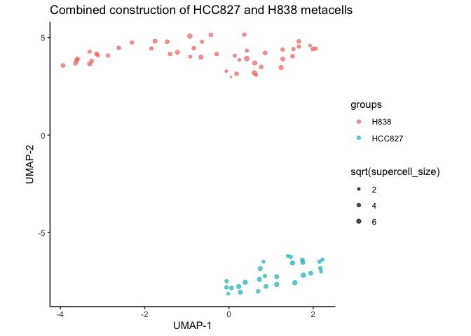
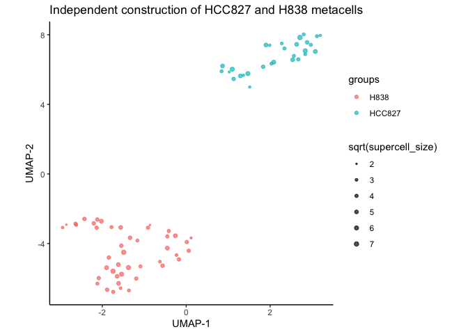
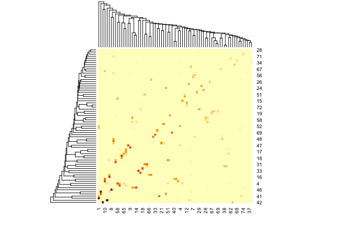

Comparing a combined (i.e., processing samples together) and an
independent (i.e., processing samples separately) construction of
metacells with *SuperCell* (related to @daskelly question
<a href="https://github.com/GfellerLab/SuperCell/issues/11#issuecomment-1090916447" class="uri">https://github.com/GfellerLab/SuperCell/issues/11#issuecomment-1090916447</a>).

``` r
library(SuperCell)
data(cell_lines)

GE <- cell_lines$GE
cell.meta <- cell_lines$meta
```

``` r
gamma <- 20 # graining level
n.pc  <- 10 # number of PCs
```

To compare results, we use 2 samples that correspond to two different
cancer cell lines (data from [Tian et al.,
2019](https://doi.org/10.1038/s41592-019-0425-8))

``` r
cell.idx.HCC827 <- which(cell.meta == "HCC827")
cell.idx.H838   <- which(cell.meta == "H838")
```

A combined analysis – construction of metacells processing two samples together
-------------------------------------------------------------------------------

``` r
SC.HCC827.H838 <- SCimplify(
  GE[,c(cell.idx.HCC827, cell.idx.H838)],  # log-normalized gene expression matrix
  gamma = gamma, # graining level
  cell.split.condition = cell.meta[c(cell.idx.HCC827, cell.idx.H838)], # metacell do not mix cells from different cell lines
  n.pc = n.pc) # number of proncipal components to use

genes.use <- SC.HCC827.H838$genes.use

SC.HCC827.H838$cell.line <- supercell_assign(cell.meta[c(cell.idx.HCC827, cell.idx.H838)], 
                                             supercell_membership = SC.HCC827.H838$membership)

SC.GE.HCC827.H838 <- supercell_GE(GE[,c(cell.idx.HCC827, cell.idx.H838)], groups = SC.HCC827.H838$membership)

SC.HCC827.H838$SC_PCA <- supercell_prcomp(
  Matrix::t(SC.GE.HCC827.H838),
  supercell_size = SC.HCC827.H838$supercell_size, 
  genes.use = genes.use)

SC.HCC827.H838$SC_UMAP <- supercell_UMAP(
  SC.HCC827.H838, 
  n_neighbors = 10)

supercell_plot_UMAP(
    SC.HCC827.H838,
    group = "cell.line",
    title = paste0("Combined construction of HCC827 and H838 metacells")
  )
```



Independent analysis – construction of metacells for each sample independently (applying the same granularity `gamma` and the same set of features `genes.use`)
---------------------------------------------------------------------------------------------------------------------------------------------------------------

``` r
SC.HCC827 <- SCimplify(GE[,cell.idx.HCC827],  # log-normalized gene expression matrix
                gamma = gamma, # graining level
                n.pc = n.pc, # number of proncipal components to use
                genes.use = genes.use) # using the same set of genes as for the combined analysis
```

    ## Warning in SCimplify(GE[, cell.idx.HCC827], gamma = gamma, n.pc = n.pc, : Normal
    ## pca is computed because number of cell is low for irlba::irlba()

``` r
SC.HCC827$cell.line <- supercell_assign(cell.meta[cell.idx.HCC827], supercell_membership = SC.HCC827$membership)

SC.H838 <- SCimplify(GE[,cell.idx.H838],  # log-normalized gene expression matrix
                gamma = gamma, # graining level
                n.pc = n.pc, # number of proncipal components to use
                genes.use = genes.use) # using the same set of genes as for the combined analysis
```

    ## Warning in SCimplify(GE[, cell.idx.H838], gamma = gamma, n.pc = n.pc, genes.use
    ## = genes.use): Normal pca is computed because number of cell is low for
    ## irlba::irlba()

``` r
SC.H838$cell.line <- supercell_assign(cell.meta[cell.idx.H838], supercell_membership = SC.H838$membership)

SC.merged <- supercell_merge(list(SC.HCC827, SC.H838), fields = c("cell.line"))

# compute metacell gene expression for SC.HCC827
SC.GE.HCC827 <- supercell_GE(GE[, cell.idx.HCC827], groups = SC.HCC827$membership)
# compute metacell gene expression for SC.H838
SC.GE.H838 <- supercell_GE(GE[, cell.idx.H838], groups = SC.H838$membership)
# merge GE matricies
SC.GE.merged <- supercell_mergeGE(list(SC.GE.HCC827, SC.GE.H838))
```

    ## 11786 of common genes has been detected

``` r
SC.merged$SC_PCA <- supercell_prcomp(
  Matrix::t(SC.GE.merged),
  supercell_size = SC.merged$supercell_size, 
  genes.use = genes.use)

SC.merged$SC_UMAP <- supercell_UMAP(
  SC.merged, 
  n_neighbors = 10)

g <- supercell_plot_UMAP(
    SC.merged,
    group = "cell.line",
    title = paste0("Independent construction of HCC827 and H838 metacells")
  )
```


\#\# Combined and independent analyses do not result in the same
metacell construction. As the dimensionality reductions (even on the
same set of features) are different for the combined (*HCC827*+*H838*)
dataset and for the independent (*HCC827* and *H838* separately)
datasets. The first PCA basen on *global* variability between two cell
lines and the PCAs from the second approach represent *local*
variability within each cell line. (sample).

``` r
heatmap(as.matrix(table(SC.merged$membership, SC.HCC827.H838$membership)), scale = "none")
```


Metacell size distribution

``` r
summary(SC.merged$supercell_size)
```

    ##    Min. 1st Qu.  Median    Mean 3rd Qu.    Max. 
    ##    4.00   12.00   19.00   20.05   27.00   55.00

``` r
summary(SC.HCC827.H838$supercell_size)
```

    ##    Min. 1st Qu.  Median    Mean 3rd Qu.    Max. 
    ##    1.00   10.25   17.50   19.78   28.00   58.00

Also, in the combined analysis, the graining level does not mean that
each cell line (or sample) will have this particular graining level. For
instance, in the combined analysis, the graining level for *HCC827* is
`18.6` and for *H838* is `21.8`, but this difference might be even more
prominent if the heterogeneity and complexity of two samples are more
different.

``` r
## Combined analysis
# actual graining level for H838 cell line
length(cell.idx.H838)/sum(SC.HCC827.H838$cell.line == "H838")
```

    ## [1] 18.6383

``` r
# actual graining level for H838 cell line
length(cell.idx.HCC827)/sum(SC.HCC827.H838$cell.line == "HCC827")
```

    ## [1] 21.77778

``` r
## Independent analysis 
# actual graining level for H838 cell line
length(cell.idx.H838)/sum(SC.merged$cell.line == "H838")
```

    ## [1] 19.90909

``` r
# actual graining level for HCC827 cell line
length(cell.idx.HCC827)/sum(SC.merged$cell.line == "HCC827")
```

    ## [1] 20.27586

``` r
# actual overal graining level in the combined analysis
length(SC.merged$membership)/max(SC.merged$membership)
```

    ## [1] 20.05479
